# MapVina Showcase

[](https://mapvina.github.io/mapvina-showcase)

Tập hợp ảnh chụp màn hình (screenshots) chứng minh các SDK MapVina chạy thành công trên **Android**, **iOS**, **Flutter** và **React Native**. Mỗi ảnh được chụp từ ứng dụng demo thực tế chạy trên emulator/simulator, hiển thị bản đồ render đúng **style MapVina**.

## Mục đích

Repo này là bằng chứng trực quan rằng MapVina SDK render bản đồ thành công trên các nền tảng mobile chính. Truy cập **[GitHub Pages gallery](https://mapvina.github.io/mapvina-showcase)** để xem toàn bộ ảnh với UI tìm kiếm và lọc theo platform.

## Các nền tảng hỗ trợ

| Platform | Status | Demo Repo |
|----------|--------|-----------|
| Android | ✅ Chạy thành công | [mapvina-document-android-github](https://github.com/mapvina/mapvina-document-android-github) |
| iOS | ✅ Chạy thành công | [mapvina-document-ios-github](https://github.com/mapvina/mapvina-document-ios-github) |
| Flutter | ✅ Chạy thành công | [mapvina-document-flutter-github](https://github.com/mapvina/mapvina-document-flutter-github) |
| React Native | ✅ Chạy thành công | [mapvina-document-reactnative-github](https://github.com/mapvina/mapvina-document-reactnative-github) |

---

## 📱 Gallery

### Android SDK

Ứng dụng demo Android hiển thị bản đồ MapVina với style streets.

<p align="center">
  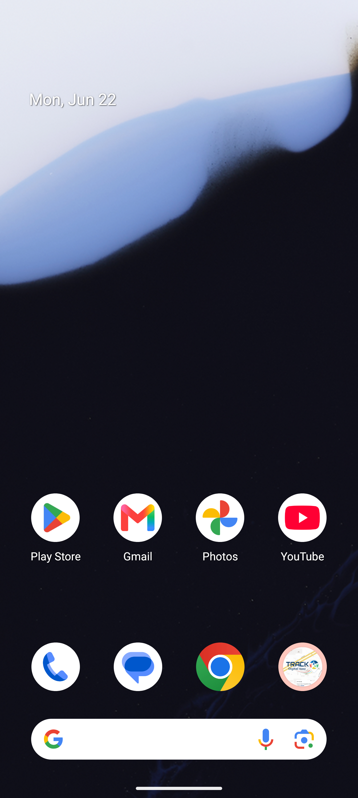
</p>

### iOS SDK

Ứng dụng demo iOS chạy trên iPhone Simulator, hiển thị bản đồ MapVina.

<p align="center">
  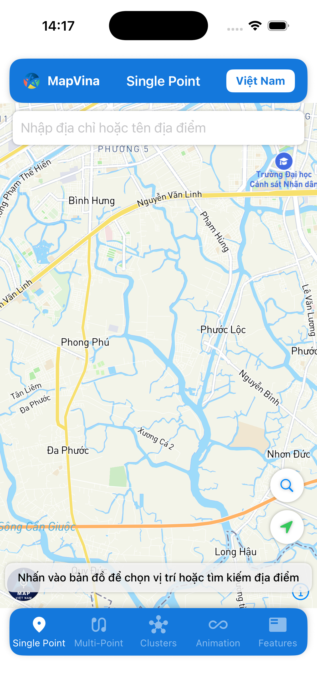
</p>

### Flutter SDK

Plugin `mapvina_gl` hiển thị bản đồ MapVina trên cả Android và iOS.

<table>
  <tr>
    <th>Android</th>
    <th>iOS</th>
  </tr>
  <tr>
    <td align="center">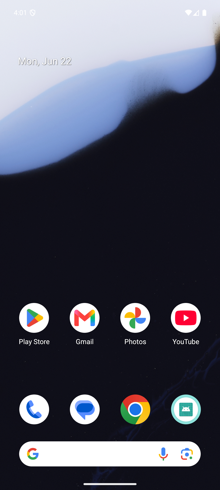</td>
    <td align="center">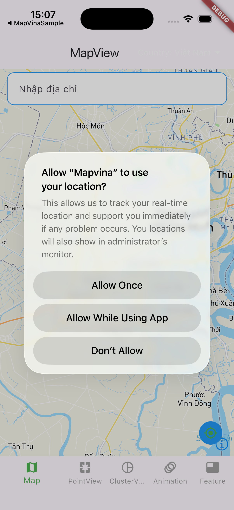</td>
  </tr>
  <tr>
    <td align="center">Flutter app trên Android Emulator</td>
    <td align="center">Flutter app trên iPhone Simulator</td>
  </tr>
</table>

### Native SDK (mapvina-native)

Test app native (OpenGL) hiển thị màn hình style/map của MapVina.

<table>
  <tr>
    <th>Android</th>
    <th>iOS</th>
  </tr>
  <tr>
    <td align="center">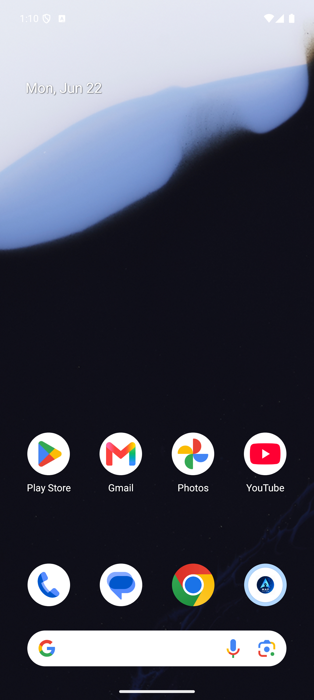</td>
    <td align="center">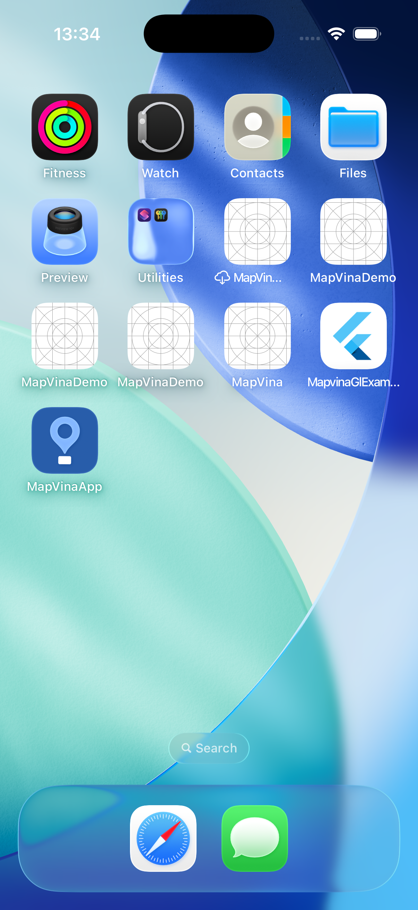</td>
  </tr>
  <tr>
    <td align="center">Native Android test app</td>
    <td align="center">Native iOS test app (build bằng Bazel)</td>
  </tr>
</table>

### React Native SDK (`@mapvina-com/mapvina-react-native`)

Ba dự án mẫu trong repo `mapvina-document-reactnative-github`, đều build & chạy thực tế trên **iPhone 16 Simulator (iOS 18.6)** và **Android Emulator (Pixel 7, API 36)**, hiển thị đúng style MapVina streets.

#### 1. MapVina-expo-app — Expo (Prebuild)

Bản đồ MapVina với user location, header & footer. Camera zoom 5 (khu vực Nam Bộ: đất liền + biển).

<table>
  <tr>
    <th>iOS</th>
    <th>Android</th>
  </tr>
  <tr>
    <td align="center">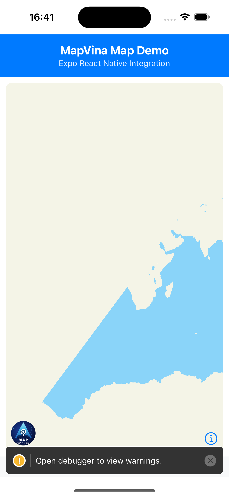</td>
    <td align="center">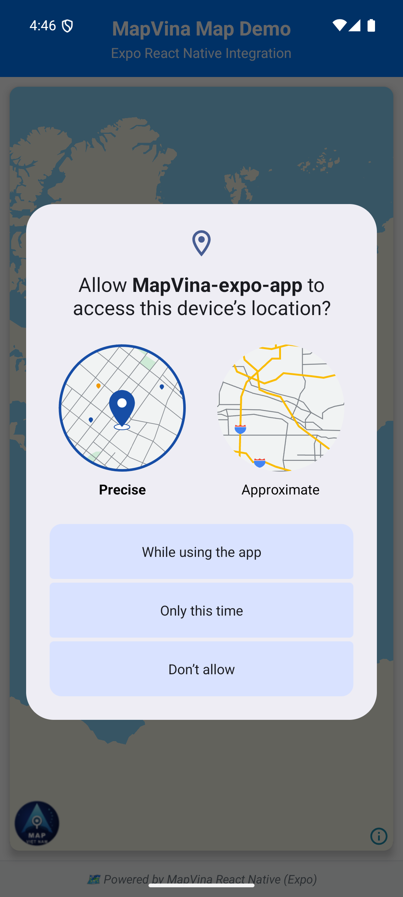</td>
  </tr>
</table>

#### 2. MapVina-react-native-app — React Native CLI thuần

Bản đồ MapVina tương tự Expo app, cấu hình native thủ công (local SPM trên iOS, `android-sdk-opengl` trên Android).

<table>
  <tr>
    <th>iOS</th>
    <th>Android</th>
  </tr>
  <tr>
    <td align="center">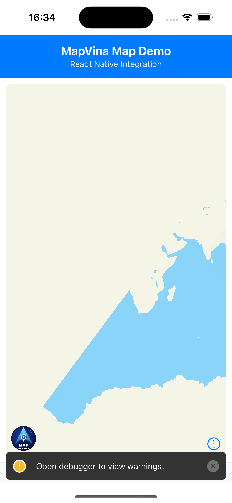</td>
    <td align="center">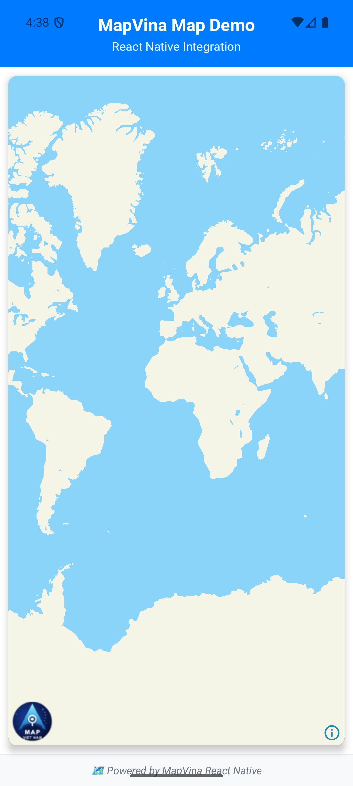</td>
  </tr>
</table>

#### 3. sample — Bộ sưu tập examples đầy đủ

Màn hình "Show Map" hiển thị bản đồ MapVina chi tiết (camera zoom 14: đường, nước, marker).

<table>
  <tr>
    <th>iOS</th>
    <th>Android</th>
  </tr>
  <tr>
    <td align="center">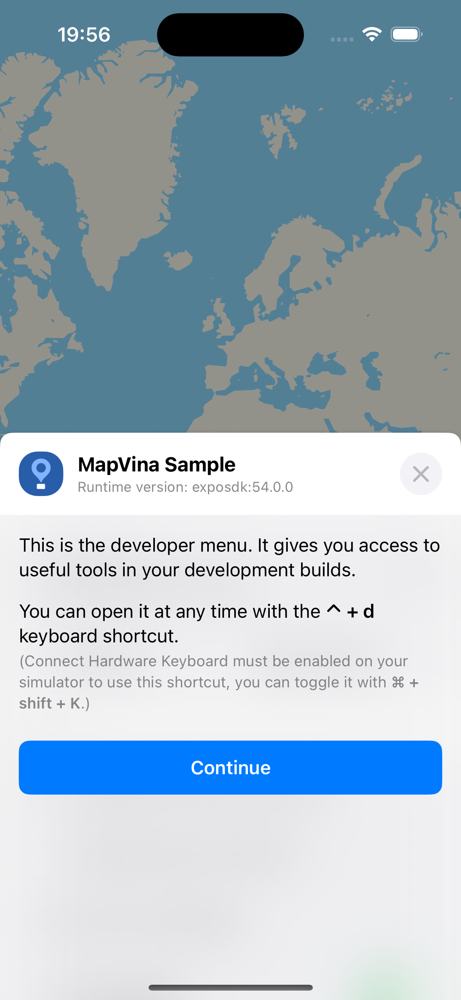</td>
    <td align="center"></td>
  </tr>
</table>

<details>
<summary>Ảnh bổ sung của sample app (danh sách examples & ShowMap)</summary>

<table>
  <tr>
    <td align="center">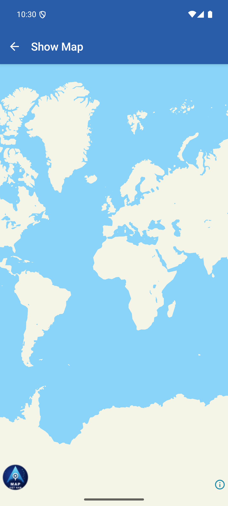<br/>ShowMap example (Android)</td>
    <td align="center">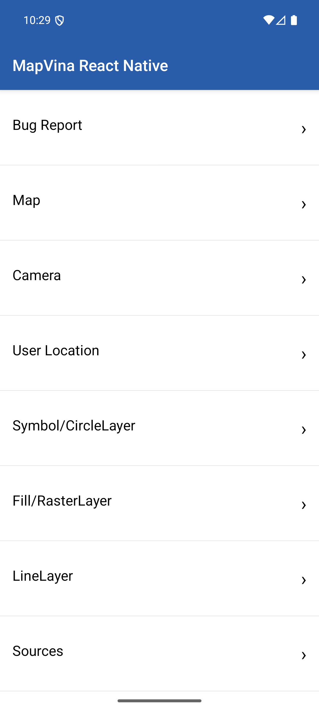<br/>Danh sách examples (Android)</td>
  </tr>
</table>

</details>

---

## Cấu trúc repo

```
mapvina-showcase/
├── docs/                    # GitHub Pages source
│   ├── index.html           # Gallery UI
│   ├── assets/css/style.css
│   └── assets/js/gallery.js
├── screenshots/             # Ảnh chụp màn hình
│   ├── android/
│   ├── ios/
│   ├── flutter/
│   ├── native/
│   └── react-native/
├── guides/                  # Hướng dẫn build & chụp
│   ├── android.md
│   ├── ios.md
│   ├── flutter.md
│   └── react-native.md
└── scripts/                 # Script tự động chụp
    ├── capture-android.sh
    └── capture-ios.sh
```

## Đóng góp

Khi cập nhật screenshot mới:
1. Chạy demo app theo hướng dẫn trong `guides/`
2. Chụp màn hình màn hình bản đồ render thành công (style MapVina)
3. Đặt ảnh vào đúng thư mục `screenshots/<platform>/`
4. Nhúng ảnh + mô tả vào `README.md` và cập nhật `docs/index.html` nếu cần
5. Commit & push

## License

Copyright © MapVina. All rights reserved.
